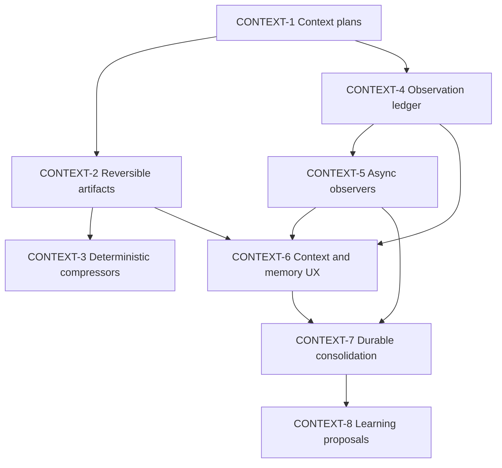

# Ticket Breakdown — Forge Context Engine

**Architecture:** [`../specs/2026-10-08-context-engine-design.md`](../specs/2026-10-08-context-engine-design.md)  
**Goal:** Make Forge context bounded, explainable, reversible, and durable across long sessions without adding a service, hidden secret store, or required setup step.

**Tracker:** [Epic #37](https://github.com/auser/forge/issues/37)

| Ticket | GitHub issue |
|---|---|
| CONTEXT-1 | [#38](https://github.com/auser/forge/issues/38) |
| CONTEXT-2 | [#39](https://github.com/auser/forge/issues/39) |
| CONTEXT-3 | [#40](https://github.com/auser/forge/issues/40) |
| CONTEXT-4 | [#41](https://github.com/auser/forge/issues/41) |
| CONTEXT-5 | [#42](https://github.com/auser/forge/issues/42) |
| CONTEXT-6 | [#43](https://github.com/auser/forge/issues/43) |
| CONTEXT-7 | [#44](https://github.com/auser/forge/issues/44) |
| CONTEXT-8 | [#45](https://github.com/auser/forge/issues/45) |

## Epic summary

Build a native context engine in progressive, independently reviewable
slices. First measure request composition, then introduce sanitized reversible
artifacts and deterministic compression. Add event-derived observational
memory only after the deterministic substrate is proven.

Every ticket preserves the append-only session log as the source of truth and
must keep bare `forge` working without configuration.

## Tickets

### CONTEXT-1 — Record deterministic context plans and cache-prefix metrics

**Scope**

Introduce the shared context accounting contract and record one plan for every
model request. No content is compressed or omitted differently in this ticket.

**Acceptance criteria**

- Record estimated sizes for system guidance, tool schemas, replay history,
  graph context, memory, current prompt, and reserved output.
- Record a stable-prefix hash and whether it changed from the prior request in
  the session.
- Store the plan under ignored `.forge/context/plans/` and link it to the run.
- JSON/session inspection can display the plan without exposing secrets.
- Existing request bytes and model answers remain unchanged.
- Unit tests cover deterministic hashing, budget arithmetic, and missing-state
  degradation.

**Context and seams**

- Architecture: data model · prompt-cache stability · rollout principles.
- Runtime request assembly and replay budgeting.
- Session event IDs and run storage.

**Estimated size:** 700–1,100 lines including tests  
**Depends on:** none

---

### CONTEXT-2 — Store sanitized reversible tool artifacts

**Scope**

Persist provider-safe complete tool outputs in a bounded content-addressed
store and expose retrieval through one bounded model tool. Do not add
content-aware compression yet; existing caps become the first compressed
views with retrieval handles.

**Acceptance criteria**

- Redaction happens before hashing and persistence.
- Identical sanitized artifacts deduplicate by content hash.
- Manifests anchor artifacts to session, run, call, and event sequence.
- Retrieval requires a query, byte/range window, or result limit.
- Missing/evicted artifacts return an explicit unavailable result.
- Store capacity and age are bounded with deterministic eviction tests.
- Files receive user-only permissions where supported.
- Existing oversized-output regression gains retrieval coverage.

**Context and seams**

- Architecture: `ContextArtifact`, `CompressedView`, storage, retrieval, and
  security contracts.
- Runtime tool dispatch and current output capping.
- Session redaction utilities.

**Estimated size:** 900–1,400 lines including tests  
**Depends on:** CONTEXT-1

---

### CONTEXT-3 — Add deterministic content-aware compressors

**Scope**

Route oversized provider-safe artifacts through deterministic compressors for
logs, search results, JSON/tabular data, and diffs. Unknown text retains the
current conservative cap plus retrieval.

**Acceptance criteria**

- Content classification is deterministic and records its reason.
- Compression preserves the architecture's required lossless fields.
- Every view states original/compressed estimates and omissions.
- Compression is discarded when it does not save context.
- A sanitized corpus measures savings and structural fidelity.
- Default activation requires the agreed corpus threshold (initial target:
  at least 30% estimated savings with all structural assertions preserved).
- Retrieval recovers omitted answers in scripted tasks.
- Git status, approvals, requirements, commands, error codes, and test names
  remain lossless.

**Context and seams**

- Architecture: compression contracts · compressor fidelity spike.
- CONTEXT-2 artifact/retrieval API.
- Graph/search and execution output formats.

**Estimated size:** 1,100–1,500 lines including fixtures/tests  
**Depends on:** CONTEXT-2

---

### CONTEXT-4 — Add a source-anchored observation ledger and renderer

**Scope**

Define observation records, source watermarks, and deterministic context
rendering. Tests feed observations directly; no observer model or background
job is introduced yet.

**Acceptance criteria**

- Observations carry stable IDs, scope, kind, content, observer version, and
  exact source event ranges.
- Ledger commits are append-only and tolerate out-of-order, non-overlapping
  ranges.
- Duplicate ranges and unsupported source anchors are rejected.
- Context rendering combines selected observations with a recent raw tail
  without representing either twice.
- Session forks inherit observations only through their cut point.
- Deleting the derived ledger and rebuilding fixtures yields byte-identical
  output.
- Observations are clearly labeled as derived data, not project instructions.

**Context and seams**

- Architecture: `Observation`, `ObservationLedger`, memory/scope, fork
  correctness.
- Session replay and fork projection.
- CONTEXT-1 planning contract.

**Estimated size:** 900–1,300 lines including tests  
**Depends on:** CONTEXT-1

---

### CONTEXT-5 — Run bounded asynchronous observer jobs

**Scope**

Create fixed event chunks and derive observations asynchronously through the
existing provider abstraction. Observational memory remains opt-in.

**Acceptance criteria**

- Chunk boundaries are deterministic and token/size bounded.
- Each source range is observed at most once per observer version.
- Jobs run with bounded concurrency and never block the active turn.
- Failed jobs retry safely without advancing the committed watermark.
- Observer output is schema-validated and source anchors are verified.
- Cost/model policy is explicit and reported by status.
- Unsupported durable claims are measurable in a reviewed evaluation corpus.
- Session fork jobs and parent jobs cannot commit into each other's ledgers.

**Context and seams**

- Architecture: observation-quality spike · security boundary.
- CONTEXT-4 ledger.
- Provider/model registry, background run lifecycle, and budget accounting.

**Estimated size:** 1,000–1,500 lines including evaluation fixtures  
**Depends on:** CONTEXT-4

---

### CONTEXT-6 — Expose context and memory controls in CLI/chat

**Scope**

Make the context engine inspectable and controllable without adding noise to
ordinary chat.

**Acceptance criteria**

- Add `/context status` and CLI equivalent for component budgets, stable-prefix
  drift, compression savings, retrieval counts, and artifact-store health.
- Add `/memory status`, `on`, `off`, `show`, and `sources`.
- Slash completion includes every new command and argument.
- Status distinguishes raw events, active observations, consolidated memory,
  and jobs in flight.
- JSON mode remains machine-readable and TTY activity remains interactive.
- Opt-in state persists per session and survives resume/fork correctly.

**Context and seams**

- Architecture: observability · rollout defaults.
- Existing chat command/controller/host seams.
- CONTEXT-1, CONTEXT-2, CONTEXT-4, and CONTEXT-5 status APIs.

**Estimated size:** 700–1,100 lines including PTY/controller tests  
**Depends on:** CONTEXT-2, CONTEXT-4, CONTEXT-5

---

### CONTEXT-7 — Consolidate durable project memory with explicit promotion

**Scope**

Bound mature session observation pools by consolidating old observations into
source-linked topic files. Project promotion is explicit; nothing silently
becomes repository guidance.

**Acceptance criteria**

- Consolidation writes versioned session-local topic files plus an index.
- Consumed observations are tombstoned only after durable files commit.
- Every durable claim retains source observation/event IDs.
- Interrupted consolidation is atomic and resumable.
- Project-memory promotion requires an explicit command/approval.
- Lexical retrieval is the default; semantic retrieval remains behind an
  evidence-based flag until it earns its cost.
- Fork and deletion semantics are documented and tested.

**Context and seams**

- Architecture: long-term storage · project/session scopes.
- CONTEXT-4/5 ledger and observer pipeline.
- Existing approval and atomic-write patterns.

**Estimated size:** 900–1,400 lines including tests  
**Depends on:** CONTEXT-5, CONTEXT-6

---

### CONTEXT-8 — Mine failed sessions into reviewable learning proposals

**Scope**

Analyze recorded failures, corrections, repeated retrievals, and repeated user
instructions, then propose—not apply—guidance or prompt-snippet changes.

**Acceptance criteria**

- `forge learn` supports session and time-window scopes.
- Proposals cite source sessions/events and explain recurrence.
- Output defaults to ignored local proposals.
- Applying a proposal is a separate explicit operation and never auto-commits.
- Secret/redaction policy applies to analysis and output.
- Tests prove unsupported or one-off events do not become recommendations.
- Metrics show proposal acceptance/rejection and recurrence after acceptance.

**Context and seams**

- Architecture: learning boundary and security posture.
- Observation/project memory from CONTEXT-7.
- Existing guidance discovery and session decision summaries.

**Estimated size:** 700–1,100 lines including tests  
**Depends on:** CONTEXT-7

## Dependency graph

## Suggested execution order

- **Wave 1:** CONTEXT-1
- **Wave 2, parallel:** CONTEXT-2 and CONTEXT-4
- **Wave 3, parallel:** CONTEXT-3 and CONTEXT-5
- **Wave 4:** CONTEXT-6
- **Wave 5:** CONTEXT-7
- **Wave 6:** CONTEXT-8

Plan dependent tickets just in time after their dependencies land. In
particular, do not finalize the observer provider/prompt plan until the ledger
contract has been implemented and exercised.
